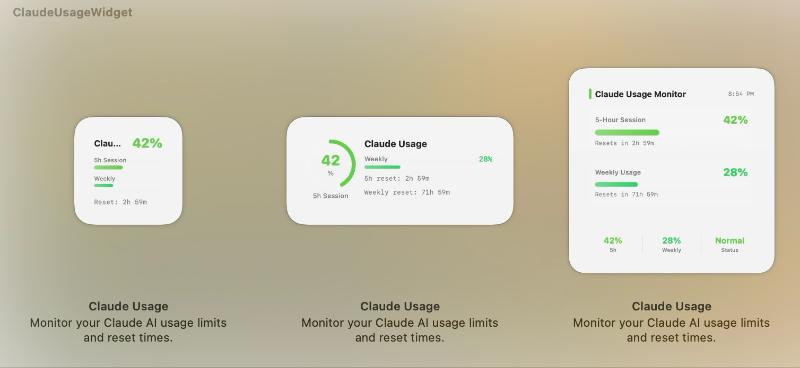

# ClaudeUsageWidget (한국어판)

Claude AI 사용량을 실시간으로 모니터링하는 macOS 데스크톱 위젯 (WidgetKit)


[English](README.md) | [中文](README_CN.md)

## 스크린샷



## 기능

- **5시간 세션 사용량** — 프로그레스 바로 한눈에 확인
- **주간 사용량** — 프로그레스 바로 한눈에 확인
- **초기화 카운트다운** — 5시간/주간 각각 표시
- **색상 단계 표시** — 녹색 → 노랑 → 주황 → 빨강
- **3가지 위젯 크기** — 소형, 중형, 대형
- **이중 인증 지원** — OAuth 토큰 또는 세션 키
- **자동 새로고침** — 5분 간격
- **한국어/영어 자동 전환** — macOS 시스템 언어에 따라 자동 적용

---

## Claude Code로 간편 설치

Claude Code 세션에 아래 내용을 붙여넣으세요:

```
https://github.com/kim-hojong/ClaudeUsageWidget_Kor 을 클론하고 빌드해줘.

단계:
1. git clone https://github.com/kim-hojong/ClaudeUsageWidget_Kor.git ~/Documents/ClaudeUsageWidget_Kor
2. Xcode에서 .xcodeproj를 열고 Development Team 설정, 또는 project.pbxproj에서 DEVELOPMENT_TEAM 수정
3. 빌드: xcodebuild -project ~/Documents/ClaudeUsageWidget_Kor/ClaudeUsageWidget.xcodeproj -scheme ClaudeUsageWidget -destination 'platform=macOS' build
4. 설치: DerivedData에서 빌드된 .app을 /Applications/ClaudeUsageWidget.app으로 ditto 복사
5. ~/.claude/claude-usage-widget.json에 Claude 세션 키(claude.ai 쿠키에서 획득)와 조직 ID(curl로 조회) 설정
6. 앱 실행: open /Applications/ClaudeUsageWidget.app
7. 바탕화면 우클릭 → 위젯 편집 → "Claude" 검색하여 추가
```

---

## 수동 설정

### 1. 빌드

```bash
git clone https://github.com/kim-hojong/ClaudeUsageWidget_Kor.git
cd ClaudeUsageWidget_Kor
open ClaudeUsageWidget.xcodeproj
```

Xcode에서:
- 두 타겟(ClaudeUsageWidget + ClaudeUsageWidgetExtension) 모두 **Development Team** 선택
- 필요 시 **Bundle Identifier** 변경
- 빌드 및 실행 (⌘R)

### 2. 인증 정보 설정

`~/.claude/claude-usage-widget.json` 파일을 생성하세요:

**방법 A: OAuth 토큰 (권장)**
```json
{
  "oauthToken": "your-oauth-bearer-token"
}
```

**방법 B: 세션 키**
```json
{
  "sessionKey": "sk-ant-sid01-...",
  "organizationId": "your-org-uuid"
}
```

<details>
<summary>세션 키 얻는 방법</summary>

1. [claude.ai](https://claude.ai)에 로그인
2. 개발자 도구 (F12) → Application → Cookies → `sessionKey` 값 복사
3. 조직 ID 조회:
```bash
curl -s https://claude.ai/api/organizations \
  -H "Cookie: sessionKey=YOUR_KEY" | python3 -m json.tool
```
출력된 JSON에서 `uuid` 값을 복사하세요.

</details>

### 3. 위젯 추가

1. 바탕화면 우클릭 → **위젯 편집...**
2. **"Claude"** 검색
3. 원하는 크기 선택 후 추가

---

## 동작 원리

위젯은 Claude 사용량 API를 호출합니다:

| 인증 방식 | 엔드포인트 |
|-----------|-----------|
| OAuth | `GET https://api.anthropic.com/api/oauth/usage` |
| 세션 키 | `GET https://claude.ai/api/organizations/{orgId}/usage` |

응답 데이터:
- `five_hour.utilization` — 5시간 윈도우 사용률 (%)
- `five_hour.resets_at` — 초기화 시각
- `seven_day.utilization` — 주간 사용률 (%)
- `seven_day.resets_at` — 주간 초기화 시각

---

## 개발

### 프로젝트 구조

```
ClaudeUsageWidget_Kor/
├── Shared/                                # 공유 코드 (양쪽 타겟에서 사용)
│   └── WidgetViews.swift                  # 위젯 뷰 + 데이터 모델 + 프리뷰
├── ClaudeUsageWidget/                     # 호스트 앱 (설정 UI)
│   ├── ClaudeUsageWidgetApp.swift
│   ├── ContentView.swift                  # 인증 정보 설정 화면
│   ├── Localizable.xcstrings              # 다국어 문자열 (앱)
│   └── Info.plist
├── ClaudeUsageWidgetExtension/            # 위젯 익스텐션
│   ├── ClaudeUsageWidget.swift            # API 통신 + Provider + Widget 정의
│   ├── ClaudeUsageWidgetBundle.swift      # 진입점
│   ├── Localizable.xcstrings              # 다국어 문자열 (위젯)
│   ├── ClaudeUsageWidgetExtension.entitlements
│   └── Info.plist
└── screenshots/
```

### 다국어 지원

String Catalog (`.xcstrings`)를 사용하여 한국어/영어를 지원합니다. macOS 시스템 언어 설정에 따라 자동 전환됩니다.

새 언어를 추가하려면 Xcode에서 `.xcstrings` 파일을 열고 언어를 추가하세요.

> **참고:** 위젯 익스텐션은 App Sandbox에서 실행됩니다. `FileManager.default.homeDirectoryForCurrentUser` 대신 `getpwuid(getuid())`를 사용하여 실제 홈 디렉토리를 찾습니다 (샌드박스 컨테이너 경로 우회).

## 요구 사항

- macOS 15.0 이상
- Xcode 16.0 이상
- Claude Pro / Team / Enterprise 구독

## 라이선스

MIT — [LICENSE](LICENSE) 참조
